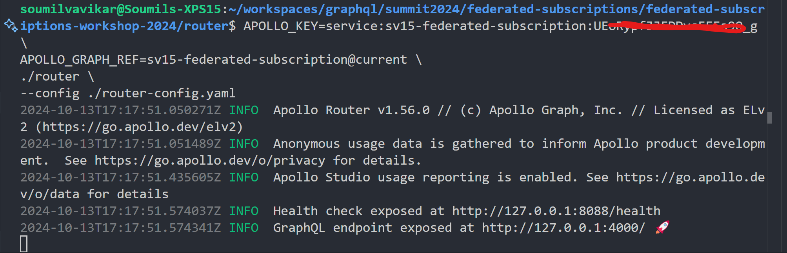
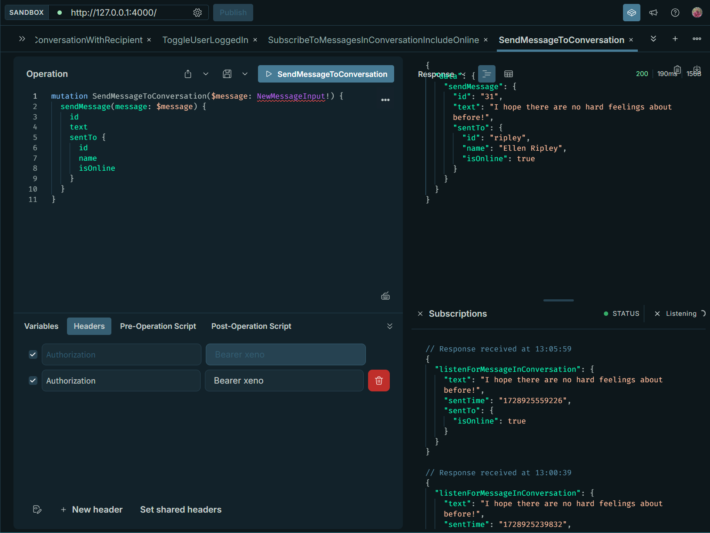

# GraphQL Federated Subscriptions

Subscriptions are operations that subscribe us to real-time data. And when we combine this with a federated architecture—propagating real-time events across our graph—the results are even more powerful.

Just like Query and Mutation, Subscription is a root-level operation type we can add to our schema. It's defined with the type keyword, followed by Subscription with a capital 'S'.

```graphql
type Subscription {
  listenForMessageInConversation(id: ID!): Message
}
```

A subscription field like listenForMessageInConversation might give the client a way to be notified anytime a new message is posted. And as the return type for each subscription event, we'd receive the new Message and could query any of its fields to learn more about it.

The router receives the query, and breaks it up to fetch data from each responsible subgraph. In addition, it tells the subgraph(s) that provide subscription data how to "call back" when new data is available.

The emitter is the mechanism that checks in with the router periodically and "emits" new subscription data. (This can be a separate service—or the subgraph itself.)

**Subgraph Responsibilities**:

- Receive subscription operation from router
- Establish connection with the router
- Retrieve and return data
- Manage periodic check-ins

The subgraph also needs to be running a framework that has implemented support for the HTTP Callback Protocol. This comes out of the box with Apollo Server.

**Note**: Because our subgraph server takes on the role of both subgraph and emitter, it's handling the last step, periodically checking in with the router.

**Router Responsibilities**:

- Receive operations from clients, break them up across the graph, and return the response
- Set the HTTP callback configuration:
  - Define path and port
  - How often the subgraph should check in
  - Which subgraphs support subscriptions

Inside of this repo you'll find three directories:

- `router`
- `messages`
- `accounts`

Each of these directories contains its own `README.md` file to get you up and running. All the three modules need to be up and running for us to be able to successfully test the federated subscriptions.

## Prerequisites

To run this repository, you'll need Node and a terminal. As part of the workshop prereqs, you should already have [Rover](https://www.apollographql.com/docs/rover/) downloaded, along with the Router binary. (You'll also have created a graph in Studio, and published this and the other subgraph schemas!)

### Check if the Subraphs and Router are UP and Running

**NOTE**: Ensure that the the subgraphs and router are started.

When we run the following command in the `accounts` subgraph folder. We should see the following logs in the terminal.

```shell
npm start
```


When we run the following command in the `messages` subgraph folder. We should see the following logs in terminal.

```shell
npm run dev
```


When we run the following command in the `router` folder, we should see the following logs in the terminal.

```shell
APOLLO_KEY=$APOLLO_KEY APOLLO_GRAPH_REF=$APOLLO_GRAPH_REF  \
./router --config ./router-config.yaml
```



## Testing Basic Operations on Supergraph

**URL**: <http://127.0.0.1:4000/>

### Get Me

**Query**:

```graphql
query GetMe {
  me {
    id
    isLoggedIn
    name
    lastActiveTime
    profileDescription
  }
}
```

**Header**:

```text
Authorization Bearer xeno
```


### Get Conversations

**Query**:

```graphql
query GetConversations {
  conversations {
    messages {
      text
      sentFrom {
        id
      }
    }
  }
}
```

**Header**:

```text
Authorization Bearer xeno
```


### Create Conversations

**Mutation**:

```graphql
mutation CreateConversationWithRecipient($recipientId: ID!) {
  createConversation(recipientId: $recipientId) {
    id
    createdAt
  }
}
```

**Variables**:

```json
{
  "recipientId": "kane"
}
```

**Header**:

```text
Authorization Bearer xeno
```


### Toggle User Login/Logout

**Mutation**:

```graphql
mutation ToggleUserLoggedIn {
  changeLoggedInStatus {
    time
    success
    message
  }
}
```

**Header**:

```text
Authorization Bearer xeno
```


## Steps followed to enable subscriptions

Detailed steps and documentation is available [here](https://www.apollographql.com/tutorials/workshop-summit-federated-subscriptions/01-intro-and-setup). The following documentation is just direct steps to enable subscriptions.

### Step 1: Update the schema.graphql in messages subgraph

#### Step 1.1: Add Subscription

```graphql
type Subscription {
  # Start a new subscription for messages in a particular conversation, with an optional timestamp cursor to replay from
  listenForMessageInConversation(id: ID!): Message
}
```

#### Step 1.2: Add Mutation

```graphql
# Submit a new message to a specified conversation
  sendMessage(message: NewMessageInput!): Message
```

Such that, the mutation type looks like below:

```graphql
type Mutation {
  # Initiate a new conversation with a particular user
  createConversation(recipientId: ID!): Conversation
  # Submit a new message to a specified conversation
  sendMessage(message: NewMessageInput!): Message
}
```

### Step 2: Publish the changes made to the messages subgraph

```shell
rover subgraph publish APOLLO_GRAPH_REF --schema ./src/schema.graphql --name messages
```

Check the Launches Section in Apollo Studio


### Step 3: Update the Router Configs to Enable Subscriptions

```yaml
# ... other configuration
subscription:
  enabled: true
  mode:
    callback:
      public_url: http://127.0.0.1:4000/callback
      listen: 127.0.0.1:4000
      path: /callback
      heartbeat_interval: 5s
      subgraphs:
        - messages
```

Restart the router server.

### Step 4: Using PubSub

Note: Using PubSub like this automatically restricts the publishing-subscribing system to a single server instance. In production, you'll want this event system to be shared by all server instances (rather than merely in-memory). Check out [this page](https://www.apollographql.com/docs/apollo-server/data/subscriptions#production-pubsub-libraries) in the official Apollo documentation for a list of PubSub libraries approved for production.

#### Step 4.1: Install `graphql-subscriptions`

```shell
npm install graphql-subscriptions
```

#### Step 4.2: Congifure `datasources/context.ts`

```ts
// Add the import and const to the top of the file.
import { PubSub } from "graphql-subscriptions";

const pubsub = new PubSub();

// Add pubsub to the `createContext`, the function should look like below

export const createContext = async ({
  req,
}: StandaloneServerContextFunctionArgument) => {
  const token = req.headers.authorization || "";
  const userId = token.split(" ")[1];
  return {
    userId,
    pubsub,
    dataSources: {
      db: new PrismaDbClient(),
      messagesAPI: new MessagesAPI(),
    },
  };
};
```

#### Step 4.3: Update the `type/DatasourceContext.ts` to leverage the `PubSub` from `graphql-subscriptions`

```ts
import { PrismaDbClient } from "../datasources/prisma/client";
import { MessagesAPI } from "../datasources/messages";
import { PubSub } from "graphql-subscriptions";

// This interface is used with graphql-codegen to generate types for resolvers context
export interface DataSourceContext {
  userId: string;
  pubsub: PubSub;
  dataSources: {
    db: PrismaDbClient;
    messagesAPI: MessagesAPI;
  };
}
```

**NOTE**: Now that pubsub is available to our resolvers, we can jump to our Mutation resolvers and add the logic that triggers a new event.

#### Step 4.4: Write the mutation resolver

```ts
import { Resolvers } from "../__generated__/resolvers-types";

export const Mutation: Resolvers = {
  Mutation: {
    createConversation: async (_, { recipientId }, { dataSources, userId }) => {
      return dataSources.db.createNewConversation({ userId, recipientId })
    },
    sendMessage: async (_, { message }, { pubsub, dataSources, userId }) => {
      const { conversationId, text } = message;
      const {
        id,
        text: messageText,
        sentFrom,
        sentTo,
        sentTime,
        ...messageAttributes
      } = await dataSources.db.sendMessageToConversation({
        conversationId,
        text,
        userId,
      });

      //await pubsub.publish("New Message Sent", {});
      await pubsub.publish("NEW_MESSAGE_SENT", {
        listenForMessageInConversation: {
          id,
          text: messageText,
          sentFrom,
          sentTo,
          sentTime,
        },
      });

      // Return all of the message that was created
      return {
        id,
        text: messageText,
        sentFrom,
        sentTo,
        sentTime,
        ...messageAttributes,
      };
    }
  }
}
```

At this point, we have done everything we need to send messages. Let's send a message.


Once, the message has been sent, we can retreive it using `Get Conversations` Query.

### Step 5: Add a `Subscription Resolver`

#### Step 5.1: Create a `Subscription.ts` resolver in messages-subgraph

```ts
import { Resolvers } from "../__generated__/resolvers-types";

export const Subscription: Resolvers = {
    Subscription: {
        listenForMessageInConversation: {
            //@ts-ignore
            subscribe: (_, __, { pubsub }) => {
                return pubsub.asyncIterator(["NEW_MESSAGE_SENT"]) 
            }
        },
    },
};
```

#### Step 5.2: Update the `index.ts` to reflect/include the new resolver

```ts
import { Query } from "./Query";
import { Mutation } from "./Mutation";
import { Message } from "./Message";
import { Conversation } from "./Conversation";
import { User } from "./User";
import { Subscription } from "./Subscription"


const resolvers = {
  ...Query,
  ...Mutation,
  ...Conversation,
  ...Message,
  ...User,
  ...Subscription
};

export default resolvers;
```

### Step 6: Try It Out

#### Step 6.1: Subscribe to a Conversation

**Operation**:

```graphql
subscription SubscribeToMessagesInConversation(
  $listenForMessageInConversationId: ID!
) {
  listenForMessageInConversation(id: $listenForMessageInConversationId) {
    text
    sentTime
  }
}
```

**Variable**:

```json
{
  "listenForMessageInConversationId": "xeno-ripley-chat"
}
```

**Header**:

```text
Authorization Bearer xeno
```


#### Step 6.2: Send Messages to the Conversation

**Mutation**:

```graphql
mutation SendMessageToConversation($message: NewMessageInput!) {
  sendMessage(message: $message) {
    id
    text
    sentTo {
      id
      name
    }
  }
}
```

**Variable**:

```json
{
  "message": {
    "text": "I hope there are no hard feelings about before!",
    "conversationId": "xeno-ripley-chat"
  }
}
```

**Header**:

```text
Authorization Bearer xeno
```


## Requring External Fields

**Header**:

Time to put our federated setup to work for us! We'll get some data from the accounts subgraph, and use it to calculate the value of a field in our messages subgraph.

### Step 1: Update Messages Subgraph to expect User type from Accounts Subgraph

#### Step 1.1: Update the schema.graphql to contain

```graphql
type User @key(fields: "id") {
  id: ID!
  "The status indicating whether a user is online"
  isOnline: Boolean! @requires(fields: "isLoggedIn lastActiveTime")
  "The last recorded activity timestamp of the user"
  lastActiveTime: String @external
  "Whether or not a user is logged in"
  isLoggedIn: Boolean! @external
}
```

#### Step 1.1: Add a new `isOnline` resolver in the `resolvers\User.ts` file

```ts
import { Resolvers } from "../__generated__/resolvers-types";

export const User: Resolvers = {
  User: {
    __resolveReference: async ({ id, ...attributes }, { dataSources }) => {
      const user = await dataSources.db.getUserDetails(id)
      return { ...attributes, ...user, id: user.username }
    },
    isOnline: ({ isLoggedIn, lastActiveTime }) => {
      const now = Date.now();
      const lastActiveDate = new Date(lastActiveTime).getTime();
      const difference = now - lastActiveDate;

      if (isLoggedIn && difference < 300000) {
        return true;
      }

      return false;
    }, 
  }
}
```

#### Step 1.2: Publish the schema

```shell
  rover subgraph publish $APOLLO_GRAPH_REF --name messages --schema ./src/schema.graphql --routing-url http://localhost:4001
```

#### Step 1.3: Update the Subscription to include `isOnline` field

**Operation**:

```graphql
subscription SubscribeToMessagesInConversationIncludeOnline(
  $listenForMessageInConversationId: ID!
) {
  listenForMessageInConversation(id: $listenForMessageInConversationId) {
    text
    sentTime
    sentTo {
      isOnline
    }
  }
}
```

**Variable**:

```json
{
  "listenForMessageInConversationId": "xeno-ripley-chat"
}
```

**Header**:

```text
Authorization Bearer xeno
```


#### Step 1.4: Test the Subscription by calling the `SendMessageToConversation` mutation

**Mutation**:

```graphql
mutation SendMessageToConversation($message: NewMessageInput!) {
  sendMessage(message: $message) {
    id
    text
    sentTo {
      id
      name
      isOnline
    }
  }
}
```

**Variable**:

```json
{
  "message": {
    "text": "I hope there are no hard feelings about before!",
    "conversationId": "xeno-ripley-chat"
  }
}
```

**Header**:

```text
Authorization Bearer xeno
```

**User Logged Out**:


**User Logged In**:



## Update Subscription to ONLY Replay Messages Recieved After

### Step 1: Update the `messages` subgraph `schema.graphql`

```graphql
type Subscription {
  # Start a new subscription for messages in a particular conversation, with an optional timestamp cursor to replay from
  listenForMessageInConversation(
    id: ID!
    fromMessageReceivedAt: String
  ): Message
}
```

### Step 2: Update the `Subscription.ts`

```ts
export const Subscription: Resolvers = {
  Subscription: {
    listenForMessageInConversation: {
      // @ts-ignore
      subscribe: async (
        _,
        { fromMessageReceivedAt, id },
        { pubsub, dataSources }
      ) => {
        // GOAL: If a cursor `fromMessageReceivedAt` is passed, fetch all messages sent after

        // Check whether a timestamp was passed
        const timestampMs = parseInt(fromMessageReceivedAt);

        // Validate that timestamp is a number, if so retrieve messages sent after that timestamp
        if (!isNaN(timestampMs) && timestampMs > 0) {
          const messages = await dataSources.db.getMessagesAfterDate(
            timestampMs,
            id
          );

          return {
            // Set up the generator
            async *[Symbol.asyncIterator]() {
              console.log(
                "STEP 1: I am called the first time the subscription runs!"
              );
              // Initially, iterate through all the messages to "play back" what was missed
              // We're not awaiting NEW messages, just yielding the messages we already have in DB
              for (let i = 0; i < messages.length; i++) {
                yield { listenForMessageInConversation: messages[i] };
              }

              console.log(
                "STEP 2 TO INFINITY: creating a new iterator for each event"
              );
              // The thing we want to do with every new message
              let iterator = {
                [Symbol.asyncIterator]: () =>
                  pubsub.asyncIterator<NewMessageEvent>(["NEW_MESSAGE_SENT"]),
              };

              // The loop that awaits new message events and yields them
              for await (const event of iterator) {
                if (event.conversationId == id) {
                  yield event;
                }
              }
            },
          };

          // If no timestamp is passed, handle new messages as we normally would
        }
        return pubsub.asyncIterator(["NEW_MESSAGE_SENT"]);
      },
    },
  },
};
```

### Step 3: Redeploy and publish the messages subgraph

```shell
  rover subgraph publish $APOLLO_GRAPH_REF --name messages --schema ./src/schema.graphql --routing-url http://localhost:4001
```

### Step 4: Update the `Subscription`

**Operation**:

```graphql
subscription SubscribeToMessagesInConversationWithMsgRecievedAt(
  $listenForMessageInConversationId: ID!
  $fromMessageReceivedAt: String
) {
  listenForMessageInConversation(id: $listenForMessageInConversationId fromMessageReceivedAt: $fromMessageReceivedAt) {
    text
    sentTime
    sentTo {
      isOnline
    }
  }
}
```

**Variables**:

```json
{
  "listenForMessageInConversationId": "xeno-ripley-chat",
  "fromMessageReceivedAt": "1728924123666"
}
```

**Header**:

```text
Authorization Bearer xeno
```


**NOTE**: The `fromMessageReceivedAt` field value can be fetched from `GetConversation` Query - There is a field in the `conversation` type named `sentTime`.

***Sample `GetConversationByRecipient` Query***

```graphql
query GetConversationWithRecipient($recipientId: ID!) {
  conversation(recipientId: $recipientId) {
    id
    createdAt
    messages {
      id
      text
      sentTime
    }
  }
}
```

*Variable*:

```json
{
  "recipientId": "ripley"
}
```

*Header*:

```text
Authorization Bearer xeno
```


