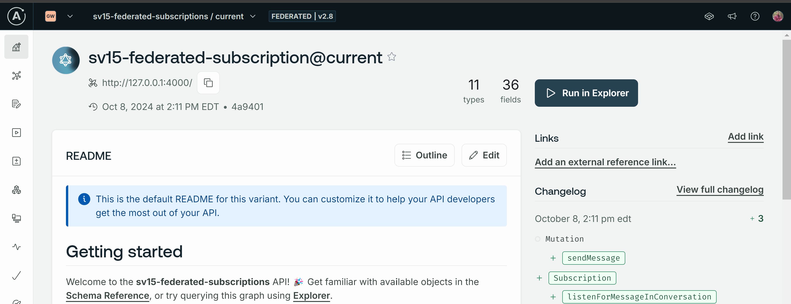
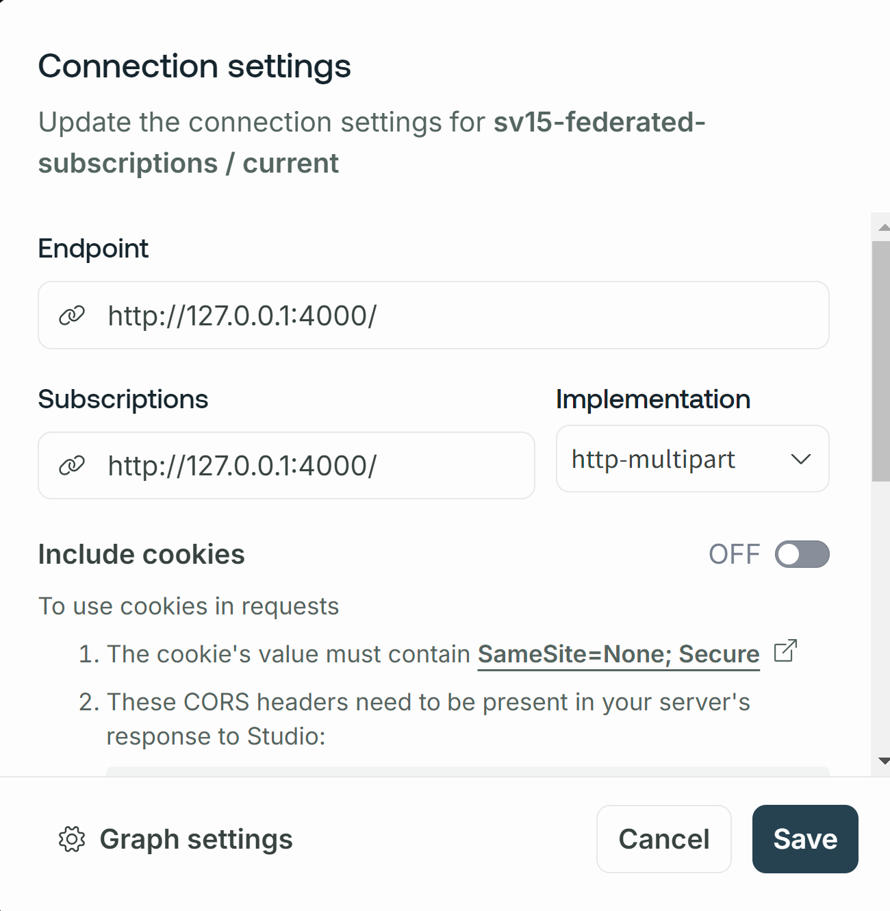

# Setting up the `router` directory

By default, this directory should look pretty empty: we've got just one file currently, called `router-config.yaml` which contains router-specific configurations.

As part of your prereqs for this, please download the Router binary into _this_ directory. You can do so by running the following command in the root of the `router` directory.

```shell
curl -sSL https://router.apollo.dev/download/nix/latest | sh
```

This will place a new file called `router` inside this folder!

## Creating a graph (Enterprise organization required)

Follow the instructions in the prerequisites to create a new graph in [GraphOS Studio](http://studio.apollographql.com), and publish your subgraph schemas using the Rover CLI.



This process will give you two key pieces of data: your `APOLLO_KEY` and your graph's unique `APOLLO_GRAPH_REF`.

Create a new `.env` file and store the two values.

```shell
APOLLO_KEY=somethingsomethingsomething
APOLLO_GRAPH_REF=mygraphname@current
```

## Running the router

Once you've secured your APOLLO_KEY and APOLLO_GRAPH_REF, you can run the router!

```shell
# Setup the environment variables in the terminal
source .env

# Run the router command
./router --config ./router-config.yaml

# OR the standard way of passing the key and graph ref at commandline.

APOLLO_KEY=$APOLLO_KEY APOLLO_GRAPH_REF=$APOLLO_GRAPH_REF  \
./router --config ./router-config.yaml
```

**Back in [Apollo Studio](https://studio.apollographql.com/graph/sv15-federated-subscription/variant/current/explorer)**, update your graph's _Connection Settings_ with the router's default URL: `http://127.0.0.1:4000`. The router's ready to be queried!


